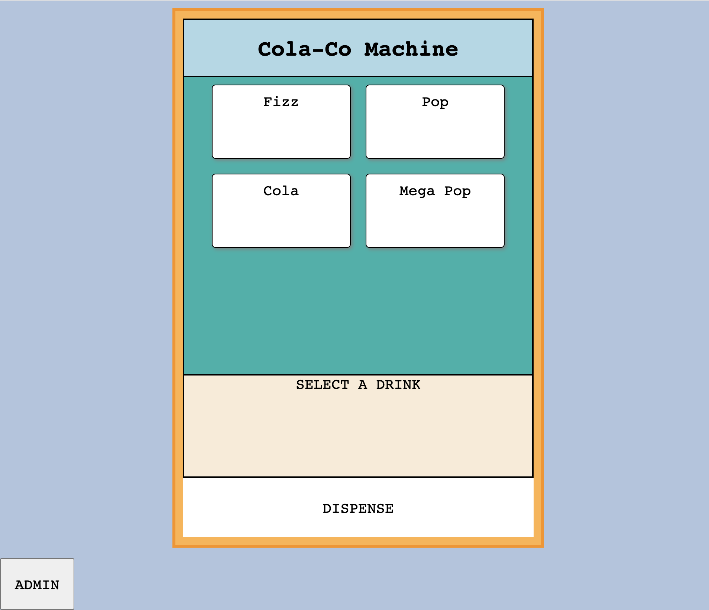
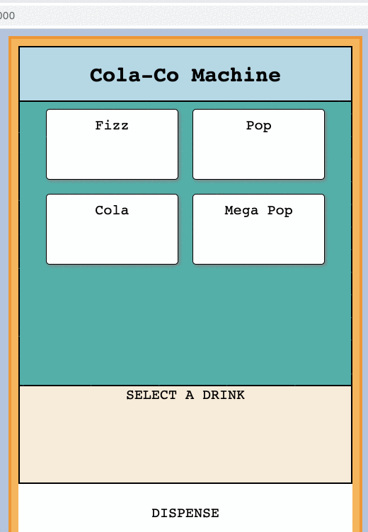
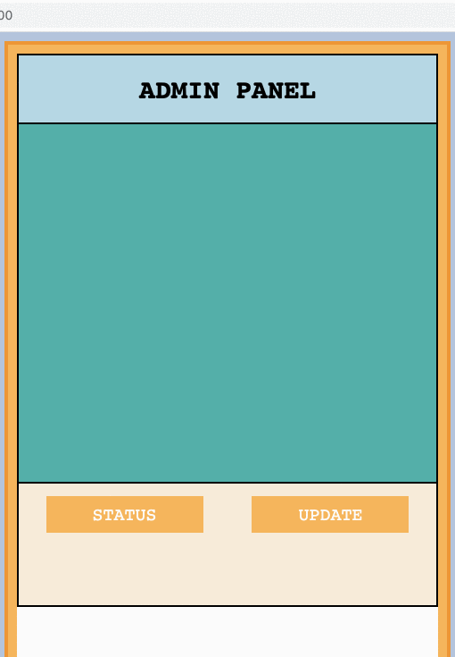

# ColaCo Machine
## Raymond Shi

*a virtual soda vending machine*



Virtual sodas are becoming increasingly popular due to their affordability and interesting flavors. This ColaCo vending machine sells a unique list of virtual sodas, each of which has its own distinguishing characteristic and appeal. Unlike traditional sodas, however, these virtual sodas come in an updated and certainly eco-friendly form. 

This project was built using the following technologies: ``NodeJS, ExpressJS, MongoDB, HTML/CSS and JavaScript``

There are two parts to the machine:
1. Customer interface
    - Select soda listings
    - Dispense sodas (download JSON file)
    


2. Admin interface
    - check soda machine status
    - add new sodas to lineup
    - edit existing soda data
    


### INSTRUCTIONS

You will need Node.js, npm and mongoDB installed to run this project
1. Visit the [official Node.js website](https://nodejs.org/) and download the installer. Follow the setups outlined on the site.
2. You should be able to run the following commands
    $ node --version
    v12.18.3

    $ npm --version
    6.14.6
3. Update npm if needed
    $ npm install npm -g

4. To install MongoDB, use a package manager like apt on Linux or homebrew on MacOS (brew install mongodb)… or follow the install instructions for your operating system on [MongoDB's site](https://www.mongodb.com/)

5. Install the project
    $ git clone https://github.com/rs5955/ColaCo-Machine
    $ cd ColaCo-Machine
    $ npm install

6. Set the database with initial entries
    $ mongo
    $ use ColaCo-Machine
    Copy and Paste the snippet below into the mongo shell and press ``ENTER``
    ```
    db.sodas.insert({name: "Fizz",desc:"An effervescent fruity experience with hints of grape and coriander",cost:1,maxQty:100});
    db.sodas.insert({name: "Pop",desc:"An explosion of flavor that will knock your socks off!",cost:1,maxQty:100});
    db.sodas.insert({name: "Cola",desc:"A basic no nonsense cola that is the perfect pick me up for any occasion.",cost:1,maxQty:200});
    db.sodas.insert({name: "Mega Pop",desc:"Not for the faint of heart.  So flavorful and so invigorating, it should probably be illegal.",cost:1,maxQty:50});
    ```
    $ db.sodas.find()
    
7. Run the app
    $ node src/app.js

8. Head to [localhost:3000/](http://localhost:3000/) to view the virtual soda machine